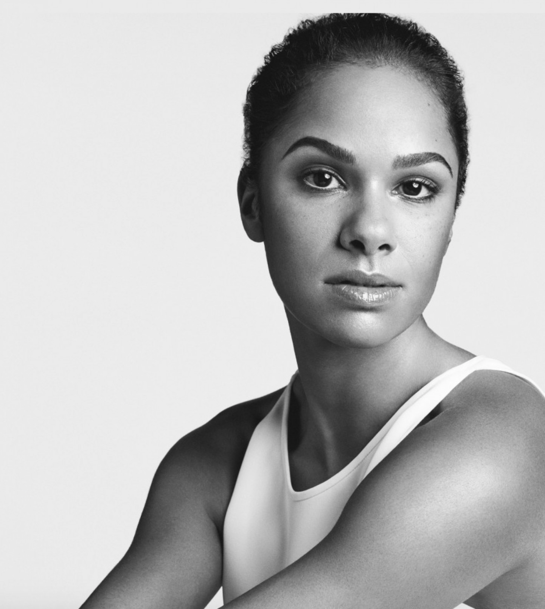

# Week 7

## Learning About Dancers

### 
This week, I gathered some of my information that is going to be on my website, I learned that most of the dancers start to dance during their childhood or the latest 18 years old.
In this website, I would also talk about Jenny Rocha, a choreographer and a creative director. Even though, she may not be really famous as the other dancers, I'm going to say how my experience was when I joined B.A.M (Brooklyn Academy of Music) in 2017 and my instructor was Jenny Rocha.

