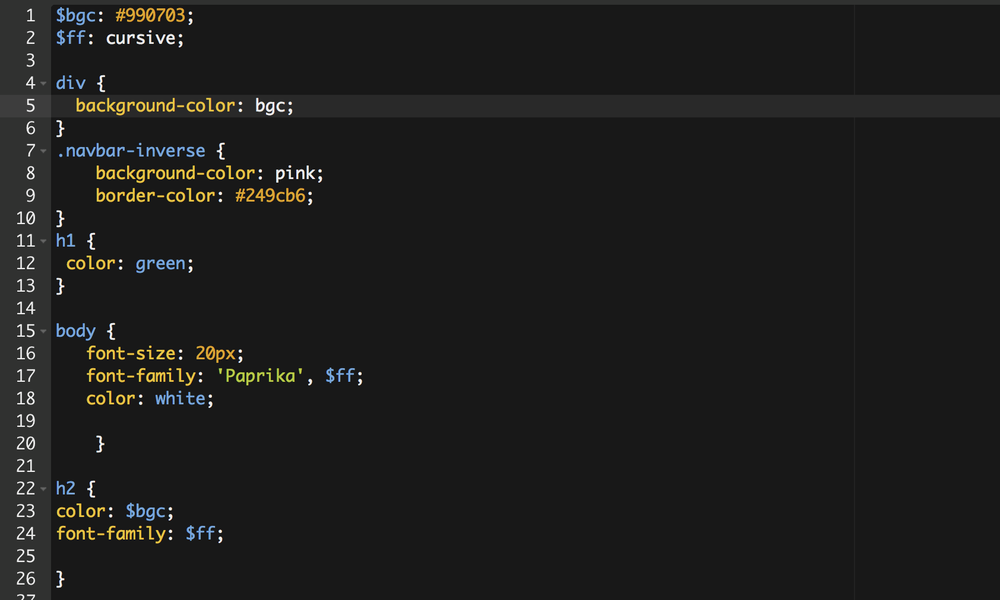
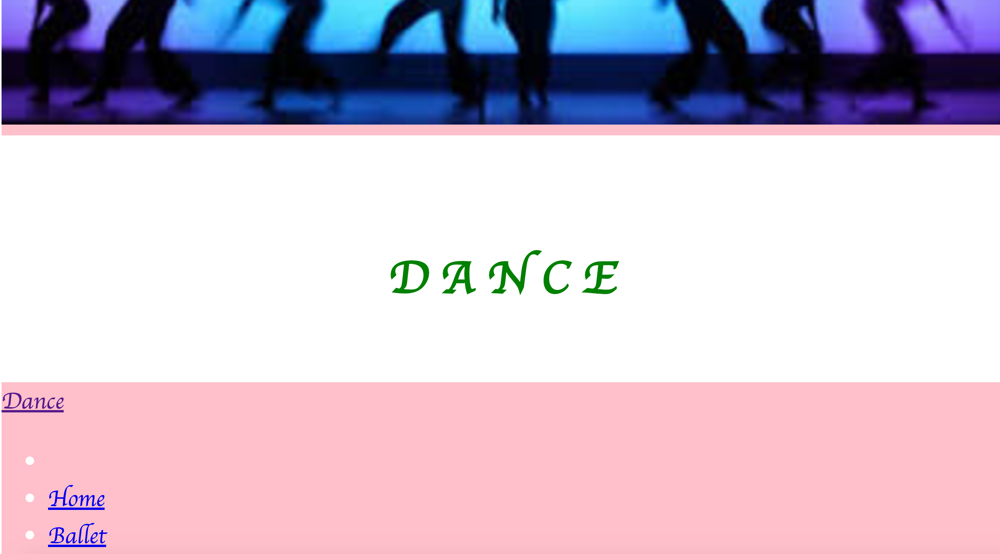

# Week 8
## Solving some Mistakes
 Throughout this week I have been struggling, I've struggled with my time management. 

As you can see, I've been trying really hard to get my website work and be as creative as it is. 
I used variables in my CSS code. Using varibles in my code makes it easier for me to type. I actually like how it saves me time.

Yes, even though Sass may sound easy, I sometimes struggle, and that's okay. Right now I've been trying to 
make my bar in my website and that involves jQuery. I added my jQuery but as you can see my sass variables 
are not cooporating with jQuery. I've changed some code in jQuery. It started to work but the only problem was that my bar wasn't there, the links were though. I am still working on it.

#Take-Aways
### 1.) Do not procastinate!!!!
### 2.) Take breaks in between your coding time before you start getting frustrated with yourself
###3.) Think about the final product! This makes me keep going

